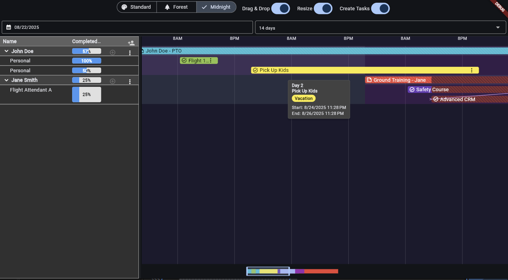

# Legacy Gantt Chart

[](https://pub.dev/packages/legacy_gantt_chart)
[](https://opensource.org/licenses/MIT)

A flexible and performant Gantt chart widget for Flutter. Supports interactive drag-and-drop, resizing, dynamic data loading, and extensive theming.



---

## Features

-   **Performant Rendering:** Uses `CustomPainter` for efficient rendering of a large number of tasks and grid lines.
-   **Dynamic Data Loading:** Fetch tasks asynchronously for the visible date range using a `LegacyGanttController`.
-   **Interactive Tasks:** Built-in support for dragging, dropping, and resizing tasks.
-   **Task Stacking:** Automatically stacks overlapping tasks within the same row.
-   **Customization:**
    -   Extensive theming support via `LegacyGanttTheme`.
    -   Use custom builders (`taskBarBuilder`, `taskContentBuilder`) to render completely unique task widgets.
-   **Timeline Navigation:** Includes a `LegacyGanttTimelineScrubber` widget for an intuitive overview and navigation of the entire timeline.
-   **Special Task Types:** Support for summary bars, background highlights (e.g., for holidays), and conflict indicators.

---

## Installation

Add this to your package's `pubspec.yaml` file:

```yaml
dependencies:
  legacy_gantt_chart: ^0.0.1 # Replace with the latest version
```

Then, you can install the package using the command-line:

```shell
flutter pub get
```

Now, import it in your Dart code:

```dart
import 'package:legacy_gantt_chart/legacy_gantt_chart.dart';
```

---

## Quick Start

Here is a minimal example of how to create a static Gantt chart.

---
## Running the Example

To see a full-featured demo of the `legacy_gantt_chart` in action, you can run the example application included in the repository.

1.  **Navigate to the `example` directory:**
    ```shell
    cd example
    ```

2.  **Install dependencies:**
    ```shell
    flutter pub get
    ```

3.  **Run the app:**
    ```shell
    flutter run
    ```

---

## Advanced Usage

### Dynamic Data Loading with `LegacyGanttController`

For real-world applications, you'll often need to load data from a server based on the visible date range. The `LegacyGanttController` is designed for this purpose.

```dart
class DynamicGanttChartPage extends StatefulWidget {
  @override
  _DynamicGanttChartPageState createState() => _DynamicGanttChartPageState();
}

class _DynamicGanttChartPageState extends State<DynamicGanttChartPage> {
  late final LegacyGanttController _controller;
  final List<LegacyGanttRow> _rows = [LegacyGanttRow(id: 'row1')];

  @override
  void initState() {
    super.initState();
    _controller = LegacyGanttController(
      initialVisibleStartDate: DateTime.now().subtract(const Duration(days: 15)),
      initialVisibleEndDate: DateTime.now().add(const Duration(days: 15)),
      tasksAsync: _fetchTasks, // Your data fetching function
    );
  }

  Future<List<LegacyGanttTask>> _fetchTasks(DateTime start, DateTime end) async {
    // In a real app, you would make a network request here.
    await Future.delayed(const Duration(seconds: 1));
    return [ /* ... your fetched tasks ... */ ];
  }

  @override
  Widget build(BuildContext context) {
    return Scaffold(
      appBar: AppBar(title: const Text('Dynamic Gantt Chart')),
      body: LegacyGanttChartWidget(
        controller: _controller,
        visibleRows: _rows,
        rowMaxStackDepth: const {'row1': 1},
      ),
    );
  }
}
```

### Timeline Navigation with `LegacyGanttTimelineScrubber`

Combine the `LegacyGanttController` with the `LegacyGanttTimelineScrubber` to provide users with a powerful way to navigate the chart's timeline.

```dart
Column(
  children: [
    Expanded(
      child: LegacyGanttChartWidget(
        controller: _controller,
        // ... other properties
      ),
    ),
    LegacyGanttTimelineScrubber(
      totalStartDate: DateTime(2023, 1, 1),
      totalEndDate: DateTime(2024, 12, 31),
      visibleStartDate: _controller.visibleStartDate,
      visibleEndDate: _controller.visibleEndDate,
      tasks: _controller.tasks,
      onWindowChanged: (newStart, newEnd) {
        _controller.setVisibleRange(newStart, newEnd);
      },
    ),
  ],
)
```

### Interactive Tasks (Drag & Drop, Resize)

Enable interactivity and listen for updates using the `onTaskUpdate` callback.

```dart
LegacyGanttChartWidget(
  // ... other properties
  enableDragAndDrop: true,
  enableResize: true,
  onTaskUpdate: (task, newStart, newEnd) {
    // Here you would update your state and likely call an API
    // to persist the changes.
  },
)
```

### Custom Task Appearance

Use `taskContentBuilder` to replace the content *inside* the task bar, or `taskBarBuilder` to replace the *entire* task bar widget for full control.

```dart
LegacyGanttChartWidget(
  // ... other properties
  taskContentBuilder: (task) {
    return Text(task.name ?? '', style: const TextStyle(color: Colors.white));
  },
)
```

### Theming

Customize colors, text styles, and more by providing a `LegacyGanttTheme`.

```dart
LegacyGanttChartWidget(
  // ... other properties
  theme: LegacyGanttTheme.fromTheme(Theme.of(context)).copyWith(
    barColorPrimary: Colors.green,
    gridColor: Colors.grey.shade800,
  ),
)
```

---

## Contributing

Contributions are welcome! Please feel free to submit a Pull Request.

---

## License

This project is licensed under the MIT License.